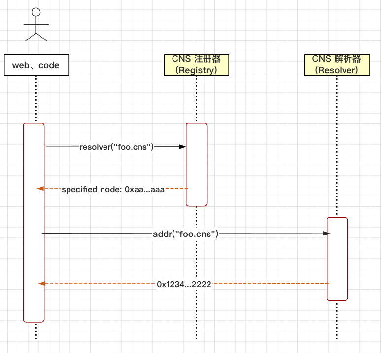

# CNS 白皮书

## 一、背景

1. 行业现状、痛楚、行业趋势

    在目前，用户参与Web3，与区块链网络的交互都是以区块链钱包及用户通过钱包生成的地址驱动，普通用户生成区块链钱包地址的成本几乎可以忽略（除少量用于资产转移及分担的手续费），此外为了确保资产安全，方便使用很少有用户在会选择将其个人信息绑定到单一的区块链地址上，由此产生了一系列问题：

    1. 用户对于特定地址的情感依赖弱：随着使用环境和使用需求的变化，用户能够以极低的成本放弃地址；
    2. 链上交互数据冗余及复杂度高：大多数链上分析项目，面对的数据是海量的，这类数据大都以地址集合及地址发出的区块链交易数据为单位，数据冗余度高，样本复杂。当前数据分析算法对于海量链上数据的通用性较差，分析结果不尽如人意。且项目方还需要额外对额外的分析过程以便识别机器人控制的地址，不利于项目发展及[社群维护](https://forum.gnosis-safe.io/t/community-challenge-identify-airdrop-farmers/847)；
    3. 女巫攻击猖獗：用户可通过批量创建机器人地址的方式实施女巫攻击。
    4. 权益集中化日益加剧：通过批量创建地址，社交账号等方式，实施[批量抽奖](https://twitter.com/HanweChang/status/1572000824338927618)，刷单等行为，导致完全遵守一人一号规则的普通用户难以享受Web3所带来的权益和红利。

    在当前Web3环境下，创建区块链地址及社交账户的成本极其低廉，这在一定程度导致了Web3中使用的一串16进制编码的区块链地址难以与“真人”建立联系，V神在《中心化社会：寻找Web3的灵魂》提到：Web3目前存在很多局限性，这种局限性表现在Web3中缺乏能够表示人类身份及社交关系相关的工具及设施。这样导致很多寄希望于通过Web3进行分发及输出的内容仍旧需要依赖Web2作为载体，这导致目前Web3无法在社交、内容分发方面实现质的突破。

    此外，Web3的发展仍然需要解决以下问题：

    1. 超额抵押导致的极端行情敏感性高，支撑以太坊这类公链效用货币价格增长的DeFi类活动的大多要求用户超额抵押资产，这导致在市场剧烈变化行情波动，出现链上清算时用户持有现货亏损严重。如果用户对于急剧变化的行情准备不足，在大跌时继续赎回其资产，容易出现赎回挤兑螺旋，现有Defi缺少传统Web2环境下依靠用户信用及适量抵押物作为支撑的借贷类经济活动。
    2. 利用DAO实施的攻击方法层出不穷，作为去中心化治理的重要方式：投票活动是许多DAO组织在实施治理过程中明确发展方向的重要手段。很多DAO组织使用的工具，如：Snapshot，通常以账户持有的token作为提案投票凭证，参与投票的用户大都是匿名的，通过持有海量的token即可尝试利用DAO投票的方式攻击整个生态系统，匿名DAO成员信息难以确定，而引入web2的社交媒体等认证方式效率较低，严重放大DAO治理的复杂度。
    3. NFT项目碎片化严重，质量良莠不齐，利用公链发行的NFT项目层出不穷。参与NFT创作的艺术家逐渐增多，普通用户在购买及调研NFT项目时通过Web3中碎片化的信息难以判定作品的真实性：是否真的由艺术家创作并上链，此外相关NFT项目缺少去中心化的认证机制，用户接收的消息主要仍然依赖于项目方通过Web2社交方式分发的信息，因此仍然需要基于Web3的身份管理方案帮助用户进行数据源合法性认证。
2. 过渡型链上身份管理体系

    目前区块链生态发展中DID是起到重要作用的基础设施中极为重要的方向之一，在未来的区块链发展中，而迫切需要引入信用分抵押借贷（增加资金的流动性）、能够识别及抑制攻击的DAO工具（识别机器人与真人）、Web3社交（具备真人唯一映射绑定，链上链下信息互联互通），这三类也都依赖于一套身份体系，一套基础设施体系，所以CNS在Conflux网络中诞生是必然的。

    针对于DID，支持不同数据类型及字段的映射是基础：如用户从Web2映射到Web3的身份、web3原生数据行程身份、Web2+Web3数据映射到web3的身份、Web3信用评分、Web3链上行为认证等。身份映射能够结合用户的实际需求进行设定，DID身份管理在目前仍然是一片蓝海，大家都还在岸边，当然也会有很多人乘坐巨轮向着更远的地方前进，但好的结果是，DID目前尚未完全生长为成熟形态，只有更多的用户、项目方投入其中，悉心探索，才有构建出更加完整的体系。

    灵魂绑定，SBT同样是DID的重要组成部分，它分为多种：身份、DAO组织成员、出席证明、Web2的工作经验映射或是学习认证等。

    作为一种基于Web3网络开发的产品，在构建DID生态体系的过程中不可避免的会面对隐私保护、数据安全等问题，攻克相关问题，将会为Web3的发展添上增光添彩的一笔。
3. 效益

    V神曾提到：“ENS是迄今为止最成功的非DeFi类以太坊应用程序。”ENS就是是以太坊域名系统。通过ENS为用户构建出类似去中心化的电话簿，方便用户通过ENS映射找到与之绑定的唯一区块链钱包地址。

    CNS作为承上启下的枢纽（链地址、DID），将成为元宇宙的入口，帮助用户快速访问Web3与元宇宙的基础设施。其应用场景是广阔的，例如，DAO组织的成员，使用着由Dao组织统一申请并设置的内部二级域名进行分布式治理，在确保能唯一识别用户的前提下，有效提高用户的获得感、归属感和参与感。

## 二、产品概述

1. 域名注册顺序过程

    1. 连接钱包

        1. 目前CNS支持Metamask钱包，后续将支持更多EVM兼容钱包
        2. 钱包配置的区块链RPC网络需设置为Conflux eSpace，用户可参考Chainlist站点提供的服务[添加RPC服务](https://chainlist.org/zh)
        3. 连接钱包，意味着用户将允许CNS站点具备读取其区块链钱包地址的权限，并完全理解及同意CNS服务条款
    2. 域名冲突检测

        1. 检查register是否已经含有此域名的hashName
        2. 检验是否有其他用户在同时尝试注册相同的域名
    3. 完成注册

        1. 设置域名注册时长（以年为单位）
        2. 根据域名长度及注册时长，支付注册费用
        3. 获得域名NFT及域名权益
2. 域名管理功能

    1. 域名反向解析，用户可将将其注册的CNS域名绑定到指定的Conflux eSpace区块链钱包地址
    2. 自定义个人信息域，用户可自行设置：头像、邮箱、地址、简介、社交账号等信息，后续CNS将推出更多的绑定内容
    3. 可自定义的域名解析器，若用户在使用过程中对CNS默认提供的解析器存在顾虑，可自定义采用自行编写或选用其他解析器提供商所提供的服务。CNS将无缝支持用户按照解析器标准要求所编写的
    4. 支持二级域名的设置，DAO子域名分配
3. SBT数据匹配

    1. 子域名的构成采用多元SBT进行匹配，当需要去创建二级域名的时候，可以根据需要匹配多种SBT，如：权益证明、出席证明、学习证明、贡献证明等
4. 域名的个人站点

    1. cfx.guru顶级域名，用户基于CNS域名所设置的已投入使用，为用户提供链信息及个性化信息的展示窗口
    2. 用于展示个人个性化信息、组织列表、治理进程等信息

## 三、体系结构

1. 原理框图

		

2. 界面介绍

    1. CNS主页：域名搜索、中英文切换、靓号系统

    2. 个人钱包管理：设置域名反向解析（将CNS域名解析为Conflux eSpace钱包地址）

    3. 域名管理：已注册域名列表、收藏域名列表、用户信息详情设置与展示

## 四、产品功能

1. 主要功能点

    1. CNS注册表由单个智能合约存储，该合约将负责维护所有域和子域的列表，并存储有关域的三个关键信息：

        * 域的所有者
        * 域的解析器
        * 域下所有记录的缓存时间
    2. 域的所有者可以是外部帐户（用户）或智能合约。注册服务商只是一份智能合约，它拥有一个域，并向遵循合同中定义的一组规则的用户发出该域的子域。
    3. CNS注册表中的域所有者可能：

        * 将解析器和TTL（存活时间）设置为域
        * 将域的所有权转移到另一个地址
        * 修改子域名的所有权
2. 核心功能

    1. 子域名设置、分配、管理
    2. 子域名多种SBT匹配
    3. 域名的个人网站

五、产品优势

1. 二级子域名，天然的形成了一种由一级域名管理员组织形成的DAO组织治理架构；
2. 一级域名管理者可根据DAO组织的实际需求，向二级域名持有者分发SBT。通过DAO与SBT的结合形成的权益证明系统，能够有效提高DAO组织治理及管理效率；
3. 管理者可以根据DAO组织实际需求重新设置符合解析器标准的主域名解析器，DAO组织可根据实际需求自定义添加DAO组织介绍，DAO组织架构等信息，而不必拘泥于CNS默认提供的解析器。此外，DAO可以自行扩展二级域名的解析器，以实现自己的SBT内容；
4. 提供的个人网站、DAO组织网站，便于外界通过域名查看用户或者组织的信息。

## 六、应用价值

1. DID应用现状分析

	DID 是发展合规Web3生态的必经之路，也是目前整个 Web3发展，难以逾越的大山之一；构建完善的 DID 生态需要适宜的土壤：需要足够优秀的基础设施、恰当的时机、投机者占比较少的市场、用户认知提升等复杂因素为铺垫。目前DID形态的基础设施并没有做到尽善尽美，与 Web2 身份及个性化信息之间的绑定也在探索中启程，仅仅支持身份绑定是不够全面的，DID在DAO治理，用户识别，链上行为分析等方面仍然有巨大的发展空间与想象空间；针对DID的需求是复杂多样的，但截止2022年Q3，仍然还没有一个DID应用具备整合多方角色来完整解决链上治理，忠实用户识别等方面的需求。Conflux eSpace网络作为一条兼容EVM虚拟机的区块链，亟需DID生态作为引子，拓展延伸出符合国情及公链特色的DID生态系统，为Web3的合规发展打下良好的基础。

2. SBT分析

	SBT作为一种Web3的底层认证凭证，SBT概念自2022年5月被第一次提出后，吸引到市场大量的关注。通过与独特的Web3用户资料进行关联，形成用户唯一且不可转让的指纹。尽管ENS这类DID系统为用户生成的域名NFT是支持转让的，但不可否认的是DID与SBT之间存在着千丝万缕的联系。

	DID是与SBT极度相关的区块链链上概念概念。在DeFi和NFT为链上主导潮流时代，token是同质化代币，NFT是非同质化代币。现有支持同质化与非同质化代币的生态应用，同样需要可以证明用户及应用合法身份体系的协议，SBT的出现是必然的，因为用户在使用区块链过程中所产生的唯一数据，只能属于用户个人的。

3. 与CNS建立合作的方式：

    1.  如果您是DAPP开发者，CNS将为您提供适合您开发语言及习惯的的SDK，开发者可以基于SDK将CNS引入其DAPP站点、身份认证系统及任何对发展Conflux eSpace有益的生态应用。
    2.  如果您是合约开发者，可以修改自己域名的解析器，让它更自由、根据个人或者项目方的需求来定制解析功能

## 七、典型应用

1. CNS靓号系统
2. CNS个性化站点，展示用户的基本信息及链上信息
3. DAO 二级域名管理系统，如成员信息展示、资产分配、DAO组织留言看板及分布式办公等
4. 基于CNS的多签系统
5. POAP的发放
6. 学习认证，学习过程记录
7. 线上行为分析

